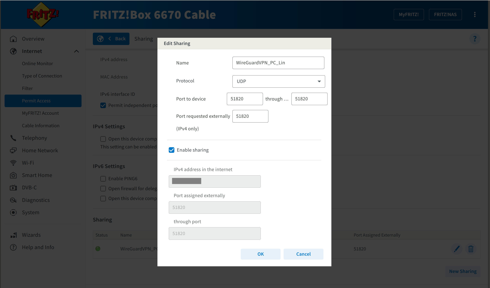

# 🔒 Remote VPN Access

This project uses **WireGuard** for secure access to the CCTV interface. It avoids exposing the cameras to the public internet by allowing access **only through an encrypted VPN tunnel**.

The VPN only allows peers with the correct cryptographic key. 

WireGuard is designed so that only devices with a matching private key can connect and that key is never sent over the network, similar to `SSH`. Instead, it uses really advanced maths to prove the key matches without revealing it. Even if someone knows your public key or tries every possible number, it would take trillions of years with today's computers to guess the right private key. That’s why brute-force attacks are not possible in practice.

## ✅ Requirements

- A router with **port forwarding** enabled (e.g., FRITZ!Box or similar)
- A **real public IPv4 address**  
  ❌ DS-Lite / IPv6-only networks will not work
- A dynamic DNS (DDNS) provider such as:
  - [MyFRITZ](https://en.avm.de/service/fritzbox/)
  - [DuckDNS](https://www.duckdns.org/)

## ⚠️ IPv6 vs IPv4 (Important)

If your ISP only gives you **DS-Lite** or **IPv6-only**, then:

- You **cannot** receive incoming connections via IPv4.
- Port forwarding will **not** work.
- WireGuard will **fail to connect from outside** your home network.

**Solution**:  
Just contact your ISP and request a **Dual Stack** connection to get a proper, public IPv4. They ususally just give it to you.

## 🌐 Openning ports example with FRITZ!Box

### Explanation for values:

To allow remote VPN access, your router must forward incoming traffic to your WireGuard server. This means:

> Any device that connects to your public IP on port `51820` must be redirected to your Ubuntu machine on the same port.

### 🔢 Port forwarding values briefly explained

| Field                    | Value          | Why                                                                 |
|--------------------------|----------------|----------------------------------------------------------------------|
| **Protocol**             | `UDP`          | WireGuard only works over UDP, not TCP.                             |
| **Port to device**       | `51820 → 51820`| Your WireGuard server listens default to port 51820, but it **can be changed** if needed. Keeping the same number internally and externally avoids confusion. |
| **Port requested externally** | `51820`  | This is the port exposed to the internet. Your client connects to `your-public-ip:51820`. |
| **Enable sharing**       | ✅ Checked     | Activates the rule so the router actually applies the forward.     |

The **port numbers must match** the `ListenPort = 51820` value in your `wg0.conf`. You can use a different port if you want (e.g. `54321`), but **you must update it in both**:

- Your router's "Port to device" and "Port requested externally"
- Your WireGuard config: `ListenPort = 54321` and client `Endpoint = your-ip:54321`



## ⬇️ Install WireGuard WireGuard

```ini
$ sudo apt install wireguard
```

## 📄 Example WireGuard Configuration

### 🖥️ Server (`/etc/wireguard/wg0.conf`)

```ini
[Interface]
Address = 10.8.0.1/24
PrivateKey = <server-private-key>
ListenPort = 51820

[Peer]
PublicKey = <client-public-key>
AllowedIPs = 10.8.0.2/32
```

#### Generate the server's key pair:

```ini
$ sudo wg genkey | tee privatekey | wg pubkey > publickey
```

This will create two files:

privatekey – your secret key (never share this!!!)

publickey – your public key (safe to share with the other peer)

| Section     | Field         | Example Value        | Explanation                                                                 |
|-------------|---------------|----------------------|-----------------------------------------------------------------------------|
| Interface   | Address       | 10.8.0.1/24          | VPN IP address of the server. `/24` allows clients from `10.8.0.1` to `.254`. |
| Interface   | PrivateKey    | <server-private-key> | Server’s private key (keep secret).                                        |
| Interface   | ListenPort    | 51820                | Port WireGuard listens on. Must match router port forward.                 |
| Peer        | PublicKey     | <client-public-key>  | Public key of the client (e.g. your phone).                                |
| Peer        | AllowedIPs    | 10.8.0.2/32          | IP to assign to the client. `/32` means “only this exact IP”.             |

**Why those values?**

- The server and all clients communicate inside a private virtual network, like `10.8.0.0/24`. That is just commonly used in VPN examples and avoids IP conflicts with home networks.

- `10.8.0.1` is used by the server; clients get eg. `10.8.0.2`, `10.8.0.3`, etc...

- `/24` means up to 254 client addresses can be used in that range.

- Each client must use `/32` — meaning “this specific address only”.

- You can change the range (e.g., `10.20.30.0/24`) but make sure it doesn’t conflict with your home Wi-Fi (e.g., `192.168.178.x`).


### 📱 Client (e.g. Android App)

```ini
[Interface]
PrivateKey = <client-private-key>
Address = 10.8.0.2/32

[Peer]
PublicKey = <server-public-key>
Endpoint = your-ddns-name.duckdns.org:51820
AllowedIPs = 0.0.0.0/0
PersistentKeepalive = 25
```

To generate the keys, Wire Guard app can do it directly.

**Why those values?**

| Section   | Field              | Example Value                         | Explanation                                                                 |
|-----------|--------------------|---------------------------------------|-----------------------------------------------------------------------------|
| Interface | PrivateKey         | <client-private-key>                  | The client’s private key (must remain secret).                             |
| Interface | Address            | 10.8.0.2/32                           | The VPN IP assigned to this client. `/32` means it only uses this one IP.  |
| Peer      | PublicKey          | <server-public-key>                  | The public key of the server. Used to encrypt traffic sent to the server.  |
| Peer      | Endpoint           | your-ddns-name.duckdns.org:51820     | Where to find the server on the internet. Must match router's public IP and port forward. |
| Peer      | AllowedIPs         | 0.0.0.0/0                             | Routes **all** traffic through the VPN.                                    |
| Peer      | PersistentKeepalive| 25                                    | Sends a small packet every 25s to keep NAT/firewall open. Useful for mobile clients. |


## ⚠️ 🔐 Never commit your private keys to Git! See .gitignore below.

```ini
# Sensitive configs
wg0.conf
privatekey
```

## 🧩 Credits: WireGuard

This project relies on **WireGuard** for safety and praticallity.

> Cammander-in-Chief would not be possible without the strength and simplicity of WireGuard.

For installation guides, documentation, and platform support, visit:  
-  [**WireGuard Webpage**](https://www.wireguard.com/)
- [**PlayStore App**](https://play.google.com/store/apps/details?id=com.wireguard.android&pli=1)

## ⚠️ **Disclaimer**  
> I’ve done my best to explain the setup, configuration, and concepts clearly and accurately.  
> However, I am **not a professional network or security expert** — this project reflects what I’ve learned and implemented for my personal use.  
